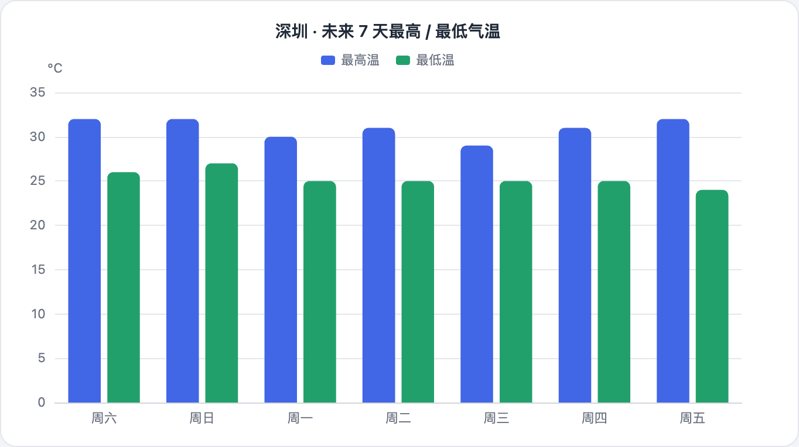
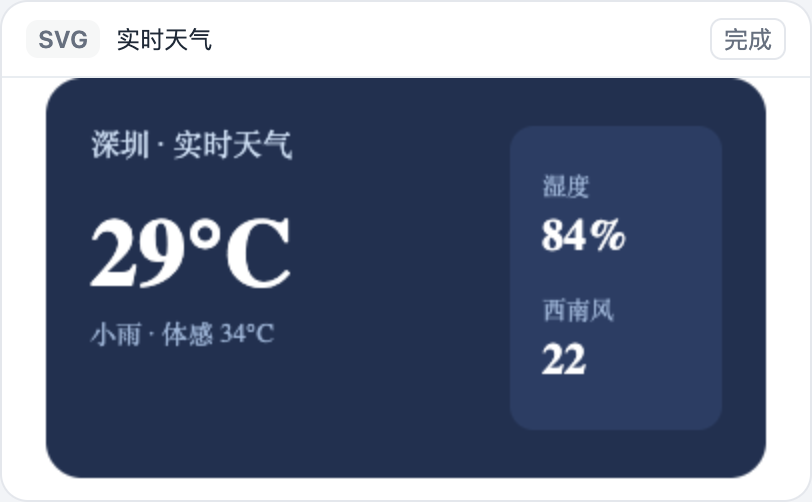
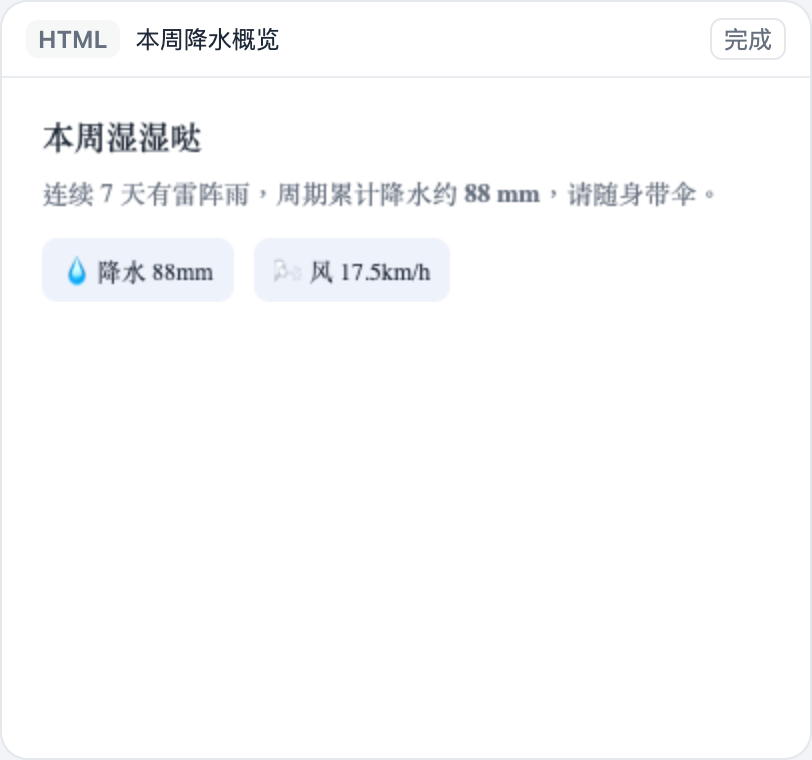
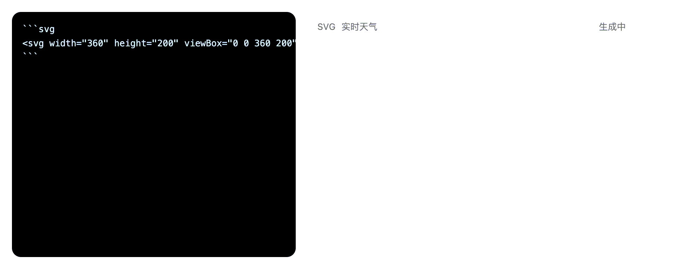
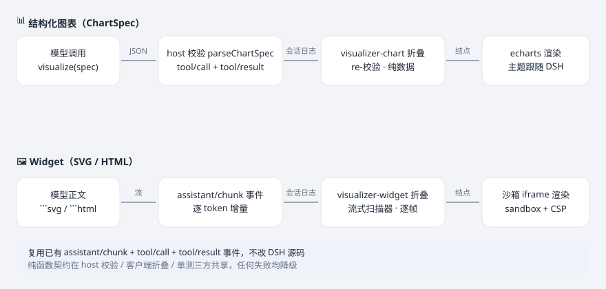

# dsh-visualizer

> 让模型在对话流里**边生成边渲染**可视化内容：流式 SVG/HTML Widget + 结构化图表（ChartSpec → echarts）。
> 一个**不改动 DSH 源码**的外部插件，打通「模型输出 → 会话日志 → 客户端折叠 → 前端安全渲染」完整链路。

<p>
  <a href="LICENSE"></a>
  = 20" src="https://img.shields.io/badge/node-%3E%3D%2020-43853d.svg">
  
  
</p>

## 效果一览

**结构化图表**（`visualize` 工具交付，echarts 渲染，主题跟随 DSH）：



**SVG Widget**（沙箱 iframe 渲染，卡片头部含类型 / 标题 / 状态徽标）：



**HTML Widget**（同样走沙箱 iframe）：



**流式渲染**（模型在正文写 ```svg 围栏 → 逐 token 边生成边更新）：



## 特性

- **两类产物、三条路径**：`visualize(spec)` 出图表；模型正文 ```svg/```html 围栏**流式**出 Widget；`visualize(widget)` 出完整组件。
- **流式渲染**：复用 DSH **已有**的 `assistant/chunk` 事件，拿到逐 token 模型输出，widget 随文本流逐帧更新。
- **不改 DSH 源码**：host 侧走 `ctx.tools.register`，客户端走 `conversation.chat.node` 槽位，复用已有事件家族。
- **双端校验**：host `execute` 与客户端折叠共用**同一套纯函数解析器**（`chartspec` / `widget`），drift 不会静默通过。
- **安全隔离**：Widget 代码**原样**插入 `sandbox=""` iframe + CSP `default-src 'none'`，无 sanitizer 可绕过。
- **渲染体验**：图表主题采样 `--dsw-alias-*` 令牌；SVG 按固有宽高比自适应高度；卡片带「适应 / 1.5× / 2×」缩放；状态徽标（生成中 / 已截断 / 完成）。
- **优雅降级**：任何校验 / 渲染失败都不留空白、不抛错中断——退回普通代码块或 JSON 卡。
- **纯函数、可测试**：核心逻辑全部是无 DSH 依赖的纯模块，97 个单测在 Node 里独立跑。

## 架构



```text
模型 ──正文流: ```svg …```──▶ llm/stream
                               │ agent-loop 逐 chunk 落盘
                               ▼
                     assistant/chunk 会话事件（已存在的事件家族）
                               │ apiproxy 实时广播到 Web 客户端
                               ▼
               visualizer-widget Definition（widget-fold.ts 流式扫描器）
                               │ match/start/update · animation-frame 节流
                               ▼
               ChatNode kind=visualizer-widget（边生成边更新）
                               ▼
           VisualizerWidgetNodeView ──▶ 沙箱 iframe（srcdoc + sandbox + CSP）

模型 ──visualize(spec|widget)──▶ ctx.tools.register（host half, visualize-tool.ts）
                               │ 校验 + tool/result 事件
                               ▼
                      session log（tool/call + tool/result）
                               ▼
      visualizer-chart Definition ──▶ echarts 节点（图表）
      visualizer-widget Definition ──▶ 沙箱 iframe 节点（widget 参数交付）
```

### 为什么这个形态可行（源码级事实）

- `assistant/chunk` 是**已存在**的会话事件家族：agent-loop 把每个 `StreamChunk` 落盘为 `{ turn, step, chunk }`，Web 客户端的流式文本就是折叠这些事件得来的——插件复用同一事件流即可拿到逐 token 输出，**无需新增 host 侧事件家族**。
- `conversationEvents` 是 cordis `Service`，外部插件可 inject；`visualizer-widget` 与内置 `assistant-step` **并行**折叠同一批 `assistant/chunk` 事件，互不干扰。
- `conversation.chat.node` 是 keyed slot（`replaceRisk: 'none'`），外部插件按字符串名注册 `{ key: 'visualizer-chart' | 'visualizer-widget' }` 即增量贡献。
- `ChatNodeViewProps` / `ConversationNodeDefinition` / `ChatNodeDataMap` 都是**纯类型**，构建期擦除，不触发客户端 bundle 的纯度门。
- **确定性**：`match` 只读当前事件；同一 Context 每个事件携带或独立推导同一稳定 id（`step:<turn>:<step>` / `widget:<callId>`）；`update` 按日志 `seq` 折叠，**可重放**。

## 安装

```sh
dsh plugin --profile web add dsh-visualizer
```

也可以从 GitHub 安装（构建产物已在仓库中，克隆后即可用）：

```sh
git clone https://github.com/Moses14159/dsh-visualizer.git
dsh plugin --profile web add /path/to/dsh-visualizer
```

> 需要本地已安装 DSH（`deepseek-harness`）并能启动 `dsh web`。插件依赖 DSH 的 `@deepseek-ai/dsh-client-runtime`、`@deepseek-ai/dsh-llm`、`@deepseek-ai/dsh-tools`（见 `peerDependencies`）。

## 使用

安装后在对话里：

- 说「**用 visualize 画个图**」→ 模型会调用 `visualize` 工具传 `spec`；
- 说「**写一个 SVG 徽章 / HTML 组件**」→ 模型在正文直接流式输出 ```svg / ```html 围栏，**生成过程中即可看到逐帧渲染**；
- 模型也可以调用 `visualize` 传 `widget` 参数**交付完整组件**（该路径经 host 校验、持久化、可重放）。

### 工具载荷

`visualize` 接收二选一：

```jsonc
// 结构化图表
{ "spec": {
    "kind": "bar",                    // bar | line | area | pie | scatter
    "title": "深圳 · 未来 7 天气温",
    "xAxis": ["周六", "周日", "周一", "周二", "周三", "周四", "周五"],
    "yName": "°C",
    "series": [{ "name": "最高温", "data": [32, 32, 30, 31, 29, 31, 32] }]
} }
```

```jsonc
// SVG / HTML 组件
{ "widget": { "kind": "svg", "code": "<svg ...>…</svg>", "title": "卡片标题" } }
```

### 流式围栏

````text
```svg
<svg width="360" height="200" viewBox="0 0 360 200" xmlns="…">
  …逐 token 边生成边渲染…
</svg>
```
````

## 载荷上限

- **图表**：≤ 8 个 series、≤ 500 个点、标签 ≤ 120 字符；
- **Widget**：单件 ≤ 128 KB（UTF-8）、每节点 ≤ 12 件 / 总计 ≤ 512 KB，超限截断或省略并显示「已截断」徽标。

## 安全边界

| 层 | 处理 |
|---|---|
| 模型 → spec / widget | host `execute` 用 `parseChartSpec` / `parseWidgetSpec` 校验；非法载荷拒绝执行（工具报错） |
| 正文流 → widget | 客户端 `WidgetScanner` 只认行首 ```svg / ```html 围栏；widget 代码**不做标记校验**（流式中任意字节都可能是合法前缀），安全边界在渲染侧 |
| session log → 客户端 | Definition 的 `update`/`fallback` 对结果文本**再次**解析；`assistant/message` 全文是冷回放的恢复源 |
| 渲染（Widget） | 双层隔离：iframe `sandbox=""`（禁脚本/同源/表单/弹窗/导航，opaque origin）+ srcdoc 注入 CSP `default-src 'none'`；代码**原样插入**，无 sanitizer 可绕过 |
| 渲染（图表） | ChartSpec 是纯数据 → echarts `setOption`；无 HTML/SVG 注入面 |

任何校验 / 渲染失败都**降级**（不渲染该节点 / 围栏仍以普通代码块显示 / JSON 卡），绝不让对话流出现空白行或抛错中断。

## 开发

```sh
pnpm install
pnpm test        # 纯函数单测（97 用例）
pnpm typecheck   # tsc --noEmit
pnpm build       # tsdown：host + replay + 两渠道 client bundle
pnpm render-demo # 重新生成 docs/ 里的演示图（需本机 Chrome）
```

- 纯函数模块（`chartspec` / `widget` / `to-echarts` / `to-iframe` / `svg-geometry` / 两个 fold）**不 import DSH、不触达 DOM**，因此能在 Node 里独立测试。
- 客户端聚合入口是 `src/client/index.tsx`；host 工具入口是 `src/index.ts`。

## 已知边界

- **图表仍是「整图出现」**：ChartSpec 经工具调用交付，没有逐 token 流式图表（工具参数本身不是流式的）；围栏 Widget 才是流式路径。
- **围栏原文与 Widget 卡并存**：模型写出的代码块仍会按普通 markdown 代码块渲染（作为「源码」视图），Widget 卡在流中增量渲染——两者不互斥。
- **Widget 是静态的**：sandbox 禁脚本，交互式组件（按钮逻辑、动画脚本）不会执行；需要交互时请用图表或让组件纯展示。
- **不包含 mermaid**：v1 只支持 svg/html 两种围栏，mermaid 图请走普通代码块或后续版本。
- **围栏必须在行首**（≤ 3 空格缩进），行内 ```svg 不是围栏；围栏内容里的 ``` 单独成行会闭合围栏（CommonMark 语义）。
- echarts 按需 `import('echarts')` 内联进客户端 bundle（registry 路由只服务单文件，暂不能 code-split）。

## 兼容性

- **Node**：`>= 20`；**DSH**：通过外部插件机制加载（profile bundle patch）。
- **peer 依赖**：`@deepseek-ai/cordis`、`@deepseek-ai/dsh-client-runtime`、`@deepseek-ai/dsh-client-ui-conversation`、`@deepseek-ai/dsh-llm`、`@deepseek-ai/dsh-tools`、`react`、`react-dom`。

## 许可

[MIT](LICENSE) · Copyright (c) 2026 Moses14159
