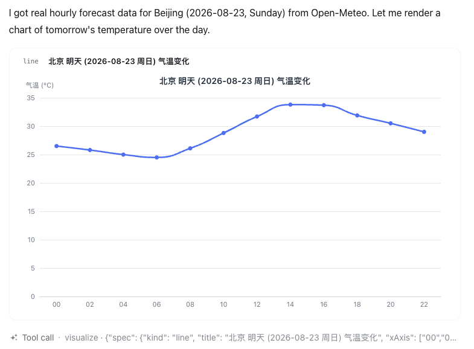
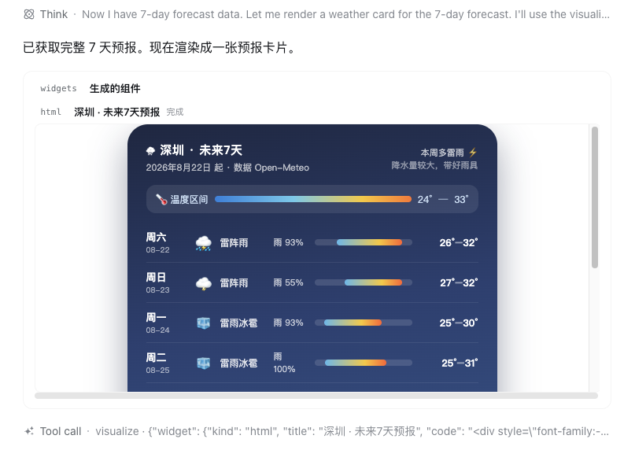
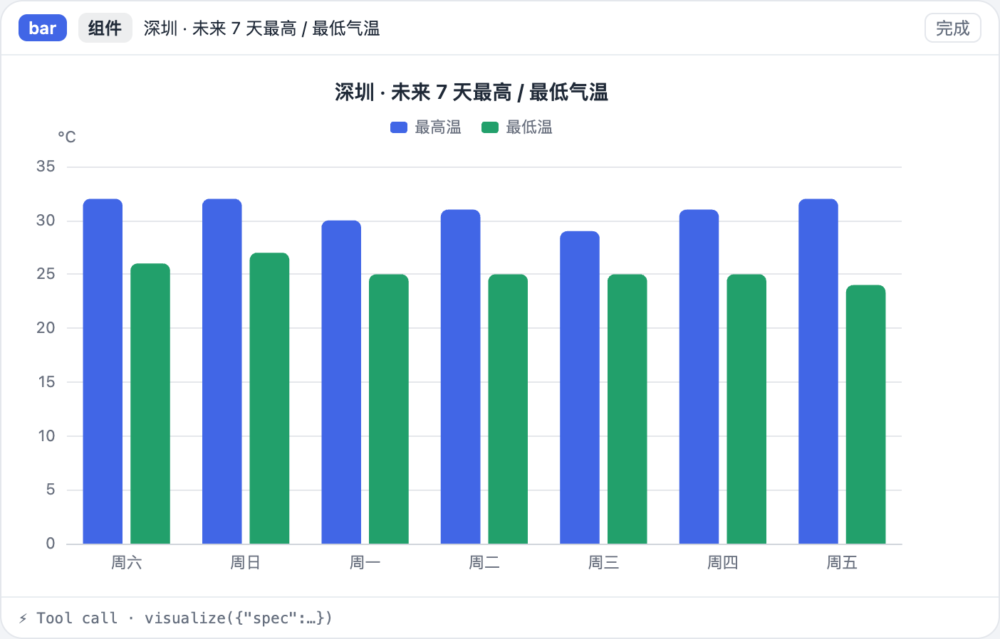
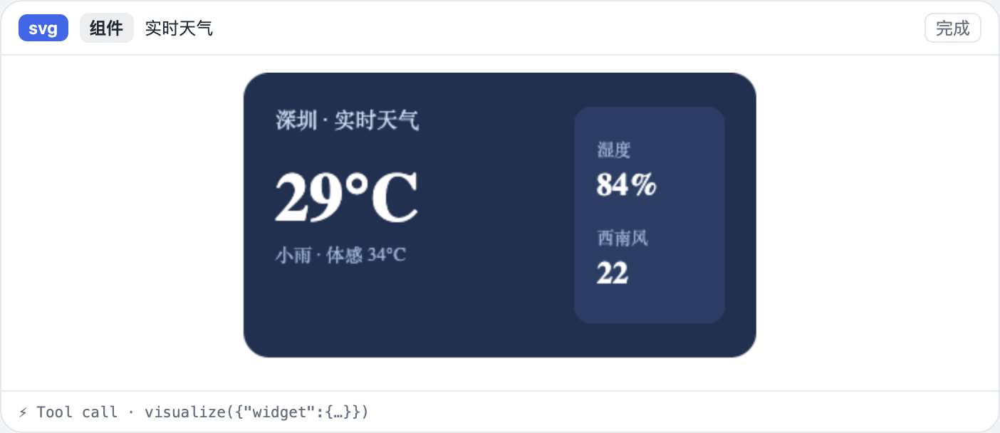
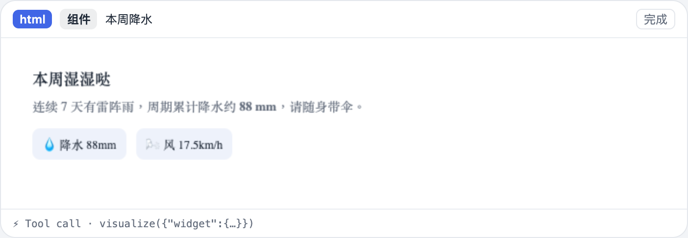
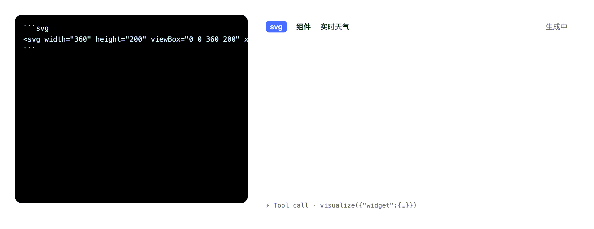

# dsh-visualizer

**English** · [简体中文](README.zh.md)

> An external plugin that **does not modify DSH source**: lets the model **render visuals on the fly** in the conversation — streaming SVG/HTML widgets and structured charts (ChartSpec → echarts).

[](LICENSE)
[](https://nodejs.org)
[](#)
[](https://github.com/Moses14159/dsh-visualizer/actions)

---

## What is this

Inside a DSH (DeepSeek Harness) conversation, let the model **produce visual content directly** and render it safely into the chat:

- **Structured charts** — the `spec` of the `visualize` tool, rendered with echarts (line / bar / area / pie / scatter).
- **SVG / HTML widgets** — the model writes &#96;&#96;&#96;svg / &#96;&#96;&#96;html fences that render **token-by-token, streaming** into a sandboxed iframe; it can also deliver a complete widget via the `widget` parameter of `visualize`.

It reuses DSH's **existing** `assistant/chunk` and `tool/call` + `tool/result` events, and **does not change DSH source**.

## Features

- **Two kinds of output, three delivery paths**: `visualize(spec)` for charts; &#96;&#96;&#96;svg / &#96;&#96;&#96;html fences in the message body for **streaming** widgets; `visualize(widget)` for a complete widget.
- **Streaming render**: reuses the existing `assistant/chunk` events to get token-by-token output, so the widget **updates frame by frame** as the text streams.
- **Two-sided validation**: host `execute` and the client fold share **the same pure-function parsers** (`chartspec` / `widget`), so model drift cannot silently pass through.
- **Security isolation**: widget code is inserted **verbatim** into a `sandbox=""` iframe + CSP `default-src 'none'`; there is no sanitizer to bypass.
- **Rendering experience**: charts sample the `--dsw-alias-*` tokens; SVG widgets size to their intrinsic aspect ratio; cards carry a "fit / 1.5× / 2×" zoom and a status badge (generating / truncated / done).
- **Graceful degradation**: any validation or render failure leaves no blank row and throws no error — it falls back to a plain code block or a JSON card.
- **Pure, testable**: the core logic is all DSH-free pure modules — 97 unit tests run standalone in Node.

## Preview

**Real conversation screenshots** (rendered inside the DSH Web client):

<div align="center">
  <br>
  <sub>Structured chart · <code>visualize(spec)</code> → echarts (follows the DSH theme)</sub>
</div>

<br>

<div align="center">
  <br>
  <sub>Widget · <code>visualize(widget)</code> → sandboxed iframe</sub>
</div>

**More render samples** (rendered by the plugin's own code):

<div align="center">
  
  
</div>

<div align="center">
  
  
</div>
<br>
<sub>Left: bar chart · Right: SVG widget · Bottom-left: HTML widget · Bottom-right: streaming render (&#96;&#96;&#96;svg fence updated token by token)</sub>

## Installation

Install directly from GitHub (recommended — the built artifacts are committed):

```sh
dsh plugin --profile web add github:Moses14159/dsh-visualizer
```

Alternatively, clone it and install from the local path:

```sh
git clone https://github.com/Moses14159/dsh-visualizer.git
dsh plugin --profile web add /path/to/dsh-visualizer
```

> - Plugins installed from Git build via their `prepare` script on install. For safety, pnpm blocks build scripts; if it prompts you, add the relevant `allowBuilds` key to the profile's `pnpm-workspace.yaml` and re-run.
> - Once `dsh-visualizer` is published to npm, you can also install it by name: `dsh plugin --profile web add dsh-visualizer`.
> - Requires DSH (`deepseek-harness`) installed locally and a working `dsh web`. It depends on DSH's `@deepseek-ai/dsh-client-runtime`, `@deepseek-ai/dsh-llm`, `@deepseek-ai/dsh-tools` (see `peerDependencies`).

## Usage

After installing, just tell the model in the conversation:

- Say "**draw a chart with visualize**" → the model calls `visualize` with a `spec`;
- Say "**write an SVG badge / HTML widget**" → the model streams &#96;&#96;&#96;svg / &#96;&#96;&#96;html fences directly in the reply, and you see it render **frame by frame as it generates**;
- The model can also pass a `widget` parameter to `visualize` to deliver a **complete widget** (validated, persisted, and replayable on the host).

### Tool payloads

`visualize` takes exactly one of:

```jsonc
// Structured chart
{ "spec": {
    "kind": "bar",                    // bar | line | area | pie | scatter
    "title": "Shenzhen · 7-day temperature",
    "xAxis": ["Sat", "Sun", "Mon", "Tue", "Wed", "Thu", "Fri"],
    "yName": "°C",
    "series": [{ "name": "Max", "data": [32, 32, 30, 31, 29, 31, 32] }]
} }
```

```jsonc
// SVG / HTML widget
{ "widget": { "kind": "svg", "code": "<svg ...>…</svg>", "title": "Card title" } }
```

### Streaming fence

````text
```svg
<svg width="360" height="200" viewBox="0 0 360 200" xmlns="…">
  …rendered token by token…
</svg>
```
````

## Examples

Say these directly in the conversation to see the effect (the images are from real conversations).

### Generate a weather card

> Help me generate a weather card for Shenzhen right now

The model calls `visualize` with a `widget` (HTML) and renders it as a sandboxed widget card:

<div align="center">
  <br>
  <sub><code>visualize(widget)</code> · an HTML card rendered in a sandboxed iframe</sub>
</div>

### Draw a line chart

> Use visualize to draw a chart of tomorrow's 24-hour temperature change in Beijing

The model passes a `spec` (`line`) and renders it with echarts:

<div align="center">
  <br>
  <sub><code>visualize(spec)</code> · echarts render (follows the DSH theme)</sub>
</div>

### Render as it streams

> Write an SVG card for Shenzhen's current weather

The model writes a &#96;&#96;&#96;svg fence in the reply and renders it as it streams:

<div align="center">
  <br>
  <sub>a &#96;&#96;&#96;svg fence in the reply · token-by-token streaming render</sub>
</div>

### Ask for several at once

> Draw a bar chart, a pie chart, and a weather card at the same time

The model calls `visualize` **multiple times** and lays out the charts and widgets in the conversation flow.

> 💡 Tip: these examples require the model to have the **`visualize` tool loaded** (registered once the plugin is installed). If the model doesn't reach for it, just describe what you want — it will prefer calling `visualize`.

## Architecture


### Two delivery paths

| Output | Trigger | Session events | Folded into | Render |
|---|---|---|---|---|
| Structured chart | `visualize(spec)` | tool/call + tool/result | `visualizer-chart` | echarts |
| Widget (delivered) | `visualize(widget)` | tool/call + tool/result | `visualizer-widget` | sandboxed iframe |
| Widget (streamed) | &#96;&#96;&#96;svg / &#96;&#96;&#96;html fences | `assistant/chunk` | `visualizer-widget` (frame updates) | sandboxed iframe |

### Why this shape works (source-level facts)

- `assistant/chunk` is an **existing** session event family: the agent-loop logs each `StreamChunk` as `{ turn, step, chunk }`, and the web client's streaming text is exactly a fold of these events — the plugin reuses the same stream to obtain token-by-token output, **without adding a new host-side event family**.
- `conversationEvents` is a cordis `Service` an external plugin can inject; `visualizer-widget` folds the same batch of `assistant/chunk` events **in parallel** with the built-in `assistant-step`, without interference.
- `conversation.chat.node` is a keyed slot (`replaceRisk: 'none'`); registering a string key — `{ key: 'visualizer-chart' | 'visualizer-widget' }` — is an additive contribution.
- `ChatNodeViewProps` / `ConversationNodeDefinition` / `ChatNodeDataMap` are all **pure types**, erased at build time, so they don't trip the client bundle's purity gate.
- **Determinism**: `match` reads only the current event; every event of one Context carries or independently derives the same stable id (`step:<turn>:<step>` / `widget:<callId>`); `update` folds one Match per log `seq`, so it is **replayable**.

## Security boundary

| Layer | Handling |
|---|---|
| Model → spec / widget | host `execute` validates with `parseChartSpec` / `parseWidgetSpec`; invalid payloads are rejected (the tool errors) |
| Text stream → widget | the client `WidgetScanner` only recognizes line-leading &#96;&#96;&#96;svg / &#96;&#96;&#96;html fences; widget code is **not markup-validated** (any byte can be a legal prefix while streaming), so the security boundary lives at the render side |
| session log → client | the Definition's `update`/`fallback` **re-parses** the result text; the full `assistant/message` is the cold-replay recovery source |
| Render (widget) | two layers of isolation: iframe `sandbox=""` (no scripts / same-origin / forms / popups / navigation, opaque origin) + an injected CSP `default-src 'none'` in the srcdoc; code is inserted **verbatim**, so there is no sanitizer to bypass |
| Render (chart) | ChartSpec is pure data → echarts `setOption`; no HTML/SVG injection surface |

Any validation or render failure **degrades** (the node isn't rendered / the fence stays a plain code block / a JSON card) — never a blank row or a thrown error in the chat.

## Payload limits

- **Charts**: ≤ 8 series, ≤ 500 points, ≤ 120 characters per label;
- **Widgets**: ≤ 128 KB per item (UTF-8), ≤ 12 items / ≤ 512 KB total per node; overflow is truncated or omitted and shows a "truncated" badge.

## Development

```sh
pnpm install
pnpm test        # pure-function unit tests (97 cases)
pnpm typecheck   # tsc --noEmit
pnpm build       # tsdown: host + replay + both channel client bundles
pnpm render-demo # regenerate docs/ demo images (needs a local Chrome)
```

- The pure-function modules (`chartspec` / `widget` / `to-echarts` / `to-iframe` / `svg-geometry` / the two folds) **don't import DSH or touch the DOM**, so they can be tested standalone in Node.
- The client entry is `src/client/index.tsx`; the host tool entry is `src/index.ts`.

## Known limitations

- **Charts still appear "whole"**: ChartSpec is delivered via a tool call, so there is no token-by-token streaming chart (tool arguments aren't streamable); the fence widgets are the streaming path.
- **The fence source and the widget card coexist**: the code block the model writes still renders as a normal markdown code block (as the "source" view), while the widget card renders in the stream — they are not mutually exclusive.
- **Widgets are static**: the sandbox disables scripts, so interactive components (button logic, animated scripts) won't run; use a chart or a purely presentational widget when you need interaction.
- **No mermaid**: v1 supports only svg/html fences; render mermaid diagrams as plain code blocks or in a later version.
- **Fences must be at line start** (≤ 3 spaces of indent); an inline &#96;&#96;&#96;svg is not a fence, and a lone &#96;&#96;&#96; line inside the content closes the fence (CommonMark semantics).
- echarts is lazily `import('echarts')` and inlined into the client bundle (the registry route serves a single file, so it can't be code-split yet).

## Compatibility

- **Node**: `>= 20`; **DSH**: loaded through the external-plugin mechanism (profile bundle patch).
- **peer dependencies**: `@deepseek-ai/cordis`, `@deepseek-ai/dsh-client-runtime`, `@deepseek-ai/dsh-client-ui-conversation`, `@deepseek-ai/dsh-llm`, `@deepseek-ai/dsh-tools`, `react`, `react-dom`.

## License

[MIT](LICENSE) · Copyright (c) 2026 Moses14159
